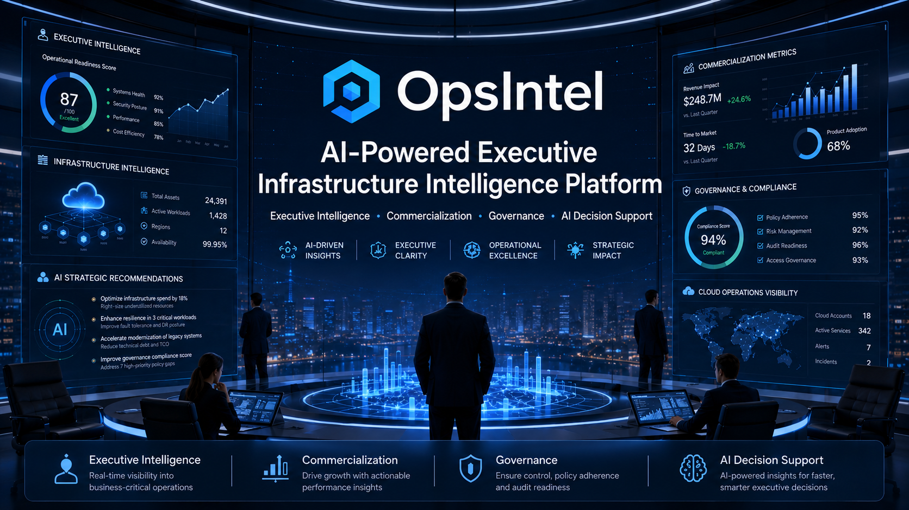

<p align="center">
  
</p>

# OpsIntel

## AI-Powered Executive Infrastructure Intelligence Platform

OpsIntel is an enterprise-grade AI-powered infrastructure intelligence platform designed to transform operational infrastructure data into executive-level insights, strategic recommendations, readiness scoring, governance visibility, and commercialization intelligence.

Unlike traditional monitoring dashboards that focus solely on metrics, OpsIntel helps technology leaders, cloud teams, consulting firms, managed service providers, and enterprise organizations make informed operational and business decisions through AI-assisted intelligence.

---

## Executive Summary

Modern organizations operate increasingly complex cloud and infrastructure environments.

OpsIntel consolidates operational visibility, governance intelligence, compliance readiness, commercialization planning, and executive decision support into a unified platform.

The platform was intentionally designed with future SaaS commercialization, enterprise deployment, and professional white-label licensing in mind.

---

## Platform Capabilities

### Executive Intelligence

- Infrastructure readiness scoring
- Risk posture evaluation
- Executive dashboards
- Strategic recommendations
- Operational intelligence

### Commercialization Intelligence

- Launch readiness analysis
- Pricing intelligence
- Revenue opportunity assessment
- Go-to-market planning
- Product strategy support

### Governance & Compliance

- Compliance visibility
- Policy assessment
- Governance insights
- Risk monitoring

### AI Decision Support

- Contextual recommendations
- Executive advisory intelligence
- Operational guidance
- Strategic insight generation

### Multi-Tenant Readiness

- Tenant-aware architecture
- Organizational management
- Role-based access foundations
- White-label readiness

---

## Core Workspaces

- Executive Workspace
- Commercialization Workspace
- Governance Workspace
- Compliance Workspace
- AI Copilot Workspace
- Customer Management Workspace
- Multi-Tenant Workspace
- Infrastructure Intelligence Workspace

**20+ enterprise-focused workspaces** designed to operate as a unified executive command center.

---

## Technology Stack

### Frontend

- Next.js
- React
- TypeScript
- Tailwind CSS

### Platform Design

- Modular Workspace Architecture
- Enterprise Dashboard Framework
- SaaS-Ready Foundations
- White-Label Architecture Strategy

### Intelligence Layer

- AI-Assisted Recommendations
- Readiness Scoring
- Operational Intelligence
- Strategic Advisory Workflows

---

## Platform Architecture

OpsIntel follows a modular enterprise architecture model:

```text
┌─────────────────────────────────────┐
│ Executive Intelligence Layer        │
└─────────────────┬───────────────────┘
                  │
┌─────────────────▼───────────────────┐
│ AI Intelligence Engines             │
└─────────────────┬───────────────────┘
                  │
┌─────────────────▼───────────────────┐
│ Workspace Framework                 │
└─────────────────┬───────────────────┘
                  │
┌─────────────────▼───────────────────┐
│ Operational & Business Intelligence │
└─────────────────┬───────────────────┘
                  │
┌─────────────────▼───────────────────┐
│ Executive Recommendations           │
└─────────────────────────────────────┘
```

This architecture enables future expansion into SaaS subscriptions, enterprise deployments, consulting services, and professional white-label licensing.

---

## Screenshots

### Dashboard Overview

*Coming Soon*

### Executive Workspace

*Coming Soon*

### Commercialization Workspace

*Coming Soon*

### Workspace Launch Grid

*Coming Soon*

### Executive Intelligence Dashboard

*Coming Soon*

---

## Commercial Strategy

OpsIntel supports multiple revenue channels.

### SaaS Subscription

Recurring monthly platform access.

### White-Label Licensing

Professional licensing for:

- Managed Service Providers (MSPs)
- DevOps Consulting Firms
- Cloud Consulting Firms
- Government Contractors

### Consulting Services

Implementation, customization, and strategic advisory engagements.

### Enterprise Deployments

Dedicated deployments for larger organizations and enterprise customers.

---

## White-Label Strategy

OpsIntel is being developed to support:

- Custom branding
- Theme customization
- Tenant provisioning
- Organizational management
- Licensing controls
- Enterprise deployment models

Target customers include:

- DevOps Consulting Firms
- Cloud Consulting Firms
- MSPs
- Government Contractors
- Enterprise IT Organizations

---

## Roadmap

### Phase 18A

OpsIntel Rebrand

### Phase 18B

White-Label Foundation

### Phase 18C

Subscription & Licensing

### Phase 18D

Customer Success Workspace

### Future Initiatives

- Predictive Intelligence
- AI Forecasting
- Marketplace Distribution
- Enterprise Reporting
- Workflow Automation
- Advanced Executive Analytics

---

## Why OpsIntel

OpsIntel demonstrates expertise across:

- Cloud Architecture
- DevOps Engineering
- SaaS Product Design
- Enterprise Platform Development
- AI-Assisted Operations
- Commercial Software Strategy

The platform represents a modern approach to transforming operational infrastructure data into strategic business intelligence.

---

## Author

**Demarko Little**

Cloud Infrastructure & DevOps Engineer

AWS Certified Solutions Architect – Associate  
AWS Certified Cloud Practitioner  
AWS Certified AI Practitioner  
Microsoft Azure Fundamentals

### Website

https://www.demarkocloud.com

### LinkedIn

https://linkedin.com/in/demarkol